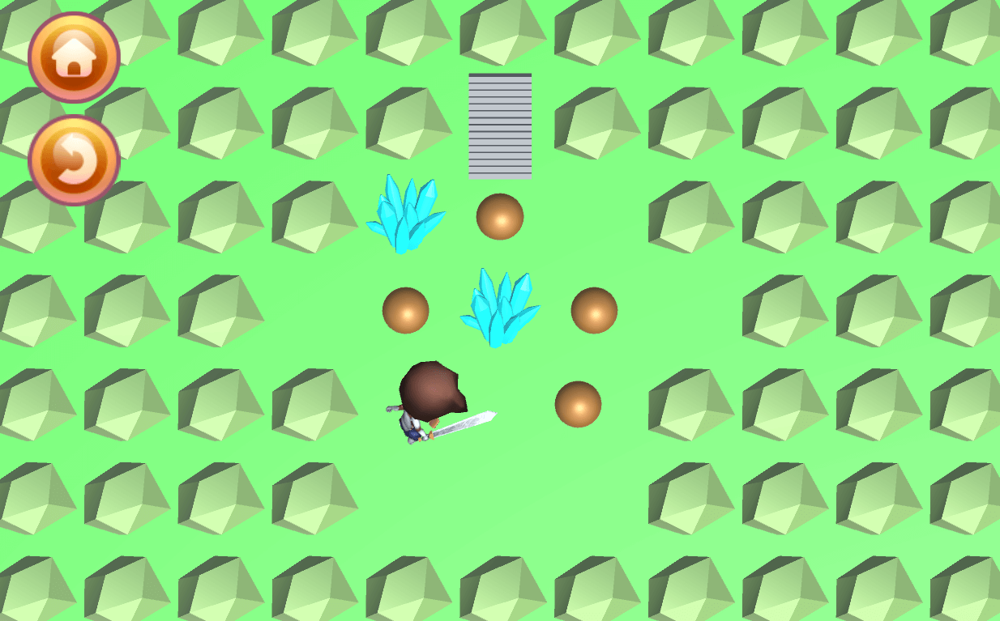
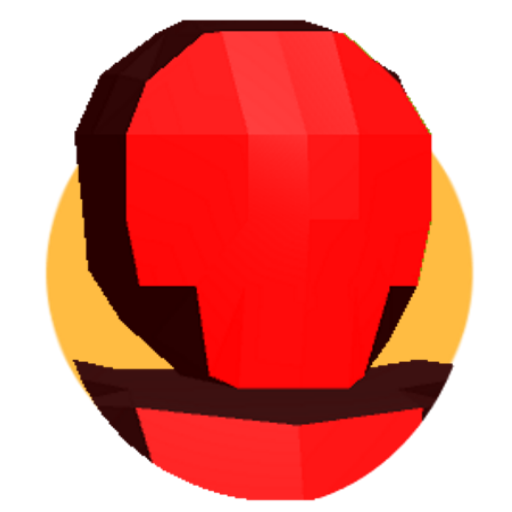
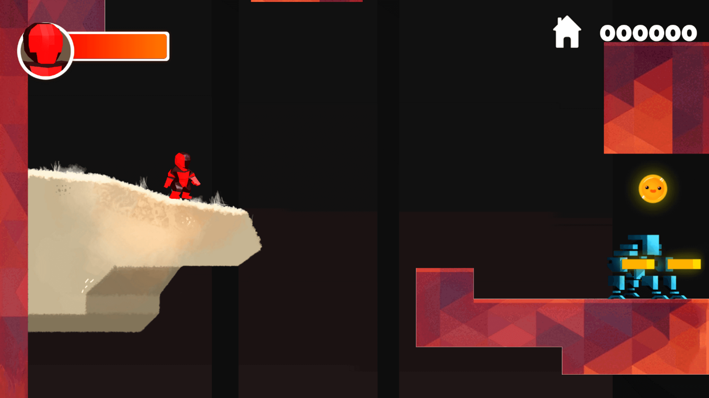
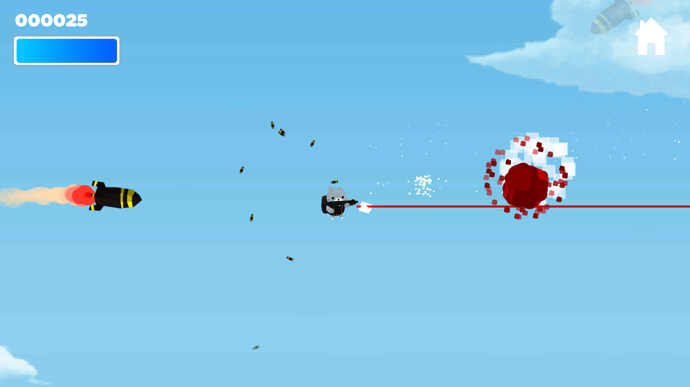

## Adknown Retro Games
All of the games I developed for Adknown Inc. as a part of the Adknown Retro Games team are displayed here. These games were developed in Unity with average development cycles of one and a half weeks (approximately 48 hours).

-------------

### Rockslide
- Implemented tiled level generation from text files to speed up design time and extensibility
- Built puzzle solving gameplay including touchscreen movement, physics, collision detection
- Among Adknown's top performing games, with over 11,000 installs on the Google Play Store

-------------

### Super Grapple
- Implemented core gameplay, including grappling hook mechanics and unlockable characters
- Among Adknown's top reviewed games

-------------

### Quest of Legend
- Implemented three different characters with different abilities
- Added random level generation using a tile-based map

-------------

### Sword Spinner
- Test
- Test

-------------

### King of Sling
- Test
- Test

-------------

### Jetpack Attack
- Test
- Test

-------------

### Astral Ace
- Test
- Test

-------------

### Tic Tac Toe
- Test
- Test

-------------

### Para-Shooter
- Test
- Test

<FilesMatch "\.(jpg|jpeg|png|gif|swf)$">
    Header set Cache-Control "max-age=604800, public"
</FilesMatch>