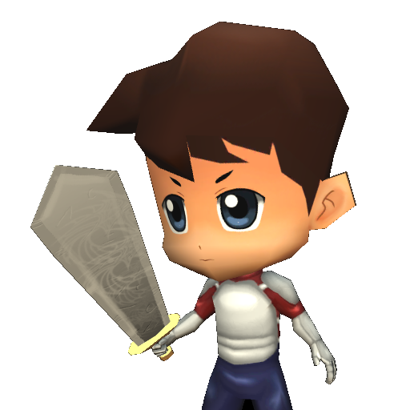
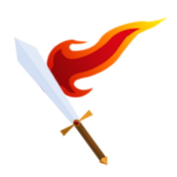
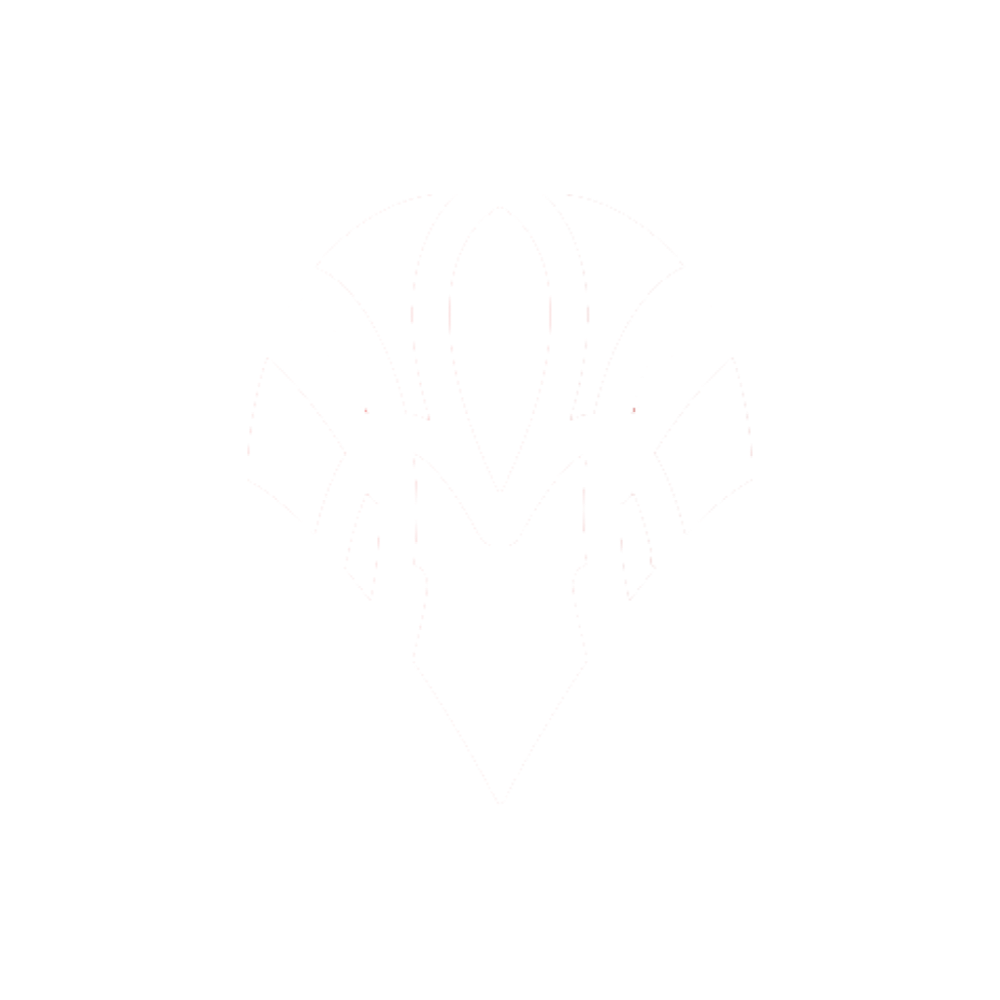

## Adknown Retro Games
All of the games I developed for Adknown Inc. as a part of the Adknown Retro Games team are displayed here. These games were developed in Unity with average development cycles of one and a half weeks (approximately 48 hours).

-------------
### Rockslide

- Implemented tiled level generation from text files to speed up design time and extensibility
- Built puzzle solving gameplay including touchscreen movement, physics, collision detection
- Among Adknown's top performing games, with over 11,000 installs on the Google Play Store

-------------
### Super Grapple

- Implemented core gameplay, including grappling hook mechanics and unlockable characters
- Among Adknown's top reviewed games

-------------
### Quest of Legend

- Implemented three different characters with different abilities
- Added random level generation using a tile-based map

-------------
### Sword Spinner

-------------
### King of Sling

-------------
### Jetpack Attack

-------------
### Astral Ace

-------------
### Tic Tac Toe

-------------
### Para-Shooter

