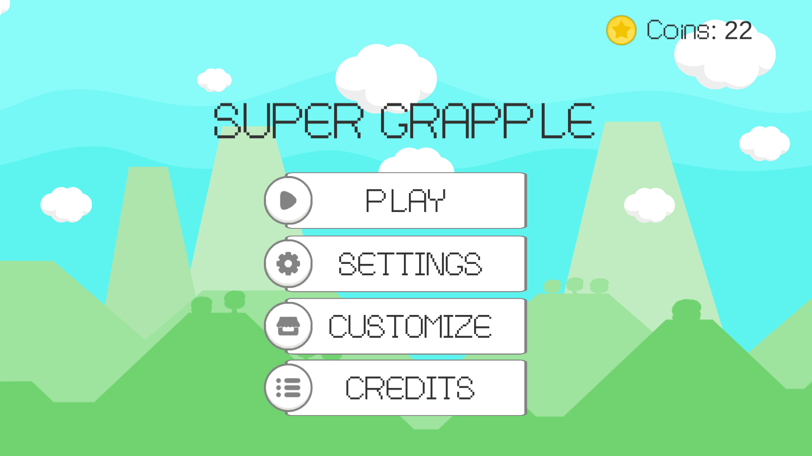
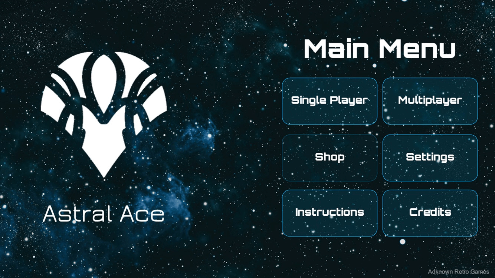
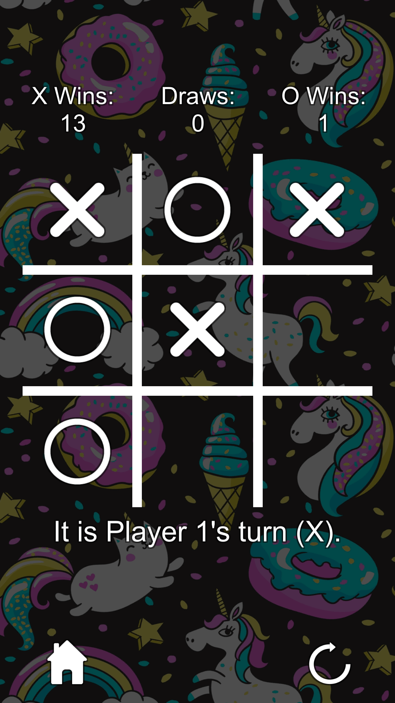

<ul class="nav">
  <li class="nav"><a href="index.html">Portfolio</a></li>
  <li class="nav"><a href="resume.html">Résumé</a></li>
</ul>

## Adknown Retro Games
All of the games I developed for Adknown Inc. as a part of the Adknown Retro Games team are displayed here. These games were developed in Unity with average development cycles of one and a half weeks (approximately 48 hours).

-------------

### Rockslide
- Implemented tiled level generation from text files to speed up design time and extensibility
- Built puzzle solving gameplay including touchscreen movement, physics, collision detection
- Among Adknown's top performing games, with over 11,000 installs on the Google Play Store

-------------

### Super Grapple
- Implemented core gameplay, including grappling hook mechanics and unlockable characters
- Among Adknown's top reviewed games

-------------

### Quest of Legend
- Implemented three different characters with different abilities
- Added random level generation using a tile-based map

-------------

### Sword Spinner
- Created mobile controls for a sword that spins around the player's touch
- Added UI health bars that appear above injured enemies
- Created physics for extra bouncy enemies
- Added a fire sword that ignites enemies, damaging them over time

-------------

### King of Sling
- Implemented sling shot physics that stretches the rubber band to the player's touch
- Created score multiplier system that awards extra points for consecutive enemy hits
- Added three different kinds of sling shot ammunition that behave differently

-------------

### Jetpack Attack
- Extended code from the [Corgi Engine](https://www.assetstore.unity3d.com/en/#!/content/26617)
- Created random level generation using pre-designed level segments

-------------

### Astral Ace
- Added multiplayer functionality using [Photon Unity Networking](https://www.assetstore.unity3d.com/en/#!/content/1786)
- Worked together with a partner to design the game and develop the gameplay
- Implemented a singleplayer mode with pursuing enemy AI

-------------

### Tic Tac Toe
- Ported an existing Java Tic-Tac-Toe game to Unity
- Optimized code
- Added unlockable backgrounds

-------------

### Para-Shooter
- Extended code from the [Corgi Engine](https://www.assetstore.unity3d.com/en/#!/content/26617)
- Created missile AI that pursues the player

