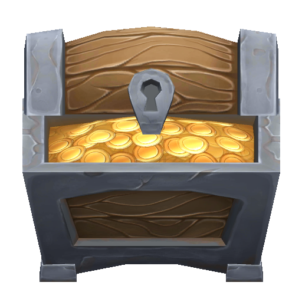

## Adknown Retro Games
All of the games I developed for Adknown Inc. as a part of the Adknown Retro Games team are displayed here. These games were developed in Unity with average development cycles of one and a half weeks (approximately 48 hours).

-------------
### Rockslide

- Implemented tiled level generation from text files to speed up design time and extensibility
- Built puzzle solving gameplay including touchscreen movement, physics, collision detection
- Among Adknown's top performing games, with over 11,000 installs on the Google Play Store

-------------
### Super Grapple

- Implemented core gameplay, including grappling hook mechanics and unlockable characters
- Among Adknown's top reviewed games

-------------
### Quest of Legend

- Implemented three different characters with different abilities
- Added random level generation using a tile-based map

-------------
### Sword Spinner

-------------
### King of Sling

-------------
### Jetpack Attack

-------------
### Astral Ace

-------------
### Tic Tac Toe

-------------
### Para-Shooter

-  Rockslide - [Android](http://www.rockslidegame.com) / [iOS](http://www.rockslideios.com) Rockslide is a top-down puzzle game where you push boulders to guide the hero to an exit. The hero is controlled by swiping in the direction you wish to move. Gems can be collected for a better level score, but watch out! Pushing a boulder over a gem will destroy it. Try to earn a perfect score on each level by collecting all of the gems!
-  Super Grapple - [Android](http://www.supergrapple.com) / [iOS](http://www.supergrappleios.com) Super Grapple features randomly generated endless scrolling levels. Tap ceiling tiles to deploy your sausage-link grappling hook and use the momentum to propel yourself to a higher score.
-  Quest of Legend - [Android](http://questoflegendgame.com/) / [iOS](http://questoflegendios.com/) Quest of Legend features randomly generated forest mazes and three unlockable characters with a unique set of skills. Vanquish enemies and collect all four legendary treasures to be victorious.
-  Sword Spinner - [Android](http://swordspinner.com/) / [iOS](http://swordspinnerios.com/) Fend off invading aliens by using your finger to swing your trusty sword. Collect shooting stars to ignite your sword and power up.
-  King of Sling - [Android](http://kingofslinggame.com/) / [iOS](http://kingofslingios.com/) Use your slingshot to fight off parachuting enemies before they reach the bottom of the screen. Bounce shots off multiple consecutive foes to multiply your score. Hit bombs to clear the screen of enemies. Collect gems to upgrade your slingshot. Climb the leaderboards and show the world what you're made of!
-  Jetpack Attack - [Android](http://jetpackattackgame.com/) / [iOS](http://jetpackattackios.com/) Jetpack through a perilous magma planet in this fast-paced action platformer. Developed with the Corgi Engine by MoreMountains.
-  Astral Ace - Coming soon! Fight off enemy ships in an intergalactic dog fight. Create public rooms and battle your friends to see who is the best Astral Ace player! Supports multiplayer through Photon Unity 3D Networking Framework.
-  Tic Tac Toe - [Android](https://tictactoedownload.com/) Play a classic game of Tic-Tac-Toe locally against a friend, or play against the computer. Unlock snazzy backgrounds the more you play!
-  Para-Shooter - Coming soon! Developed with the Corgi Engine by MoreMountains.